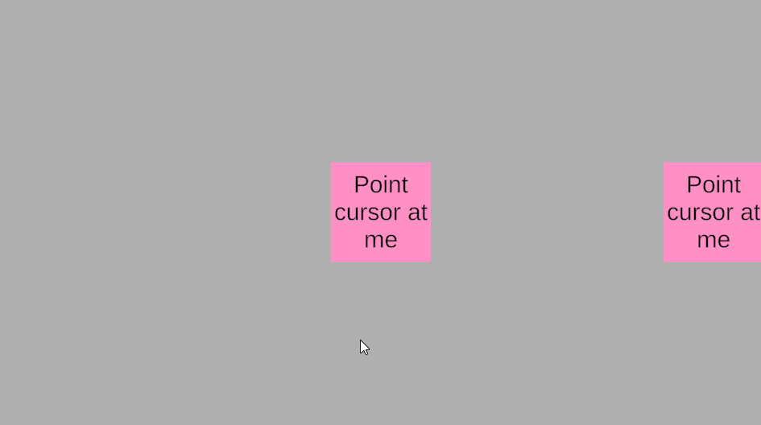
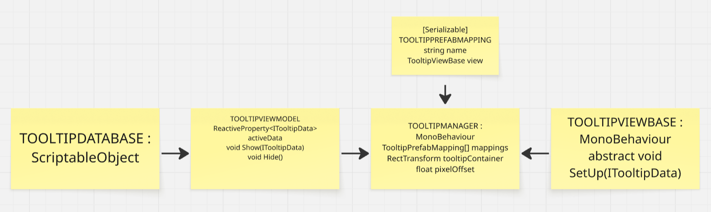

# EasyTooltip
Small lib for easy tooltip handling in unity.  
## !! IMPORTANT !!
For using, requires Zenject and R3.
## How it looks

## Configuration
1. Create DTO for your tooltip that inherits from TooltipDataBase.
2. Create View for your tooltip that inherits from TooltipViewBase.
3. Create Prefab that has your View as a component
4. Add GameObject on scene and add component TooltipManager to it.
5. Configure your TooltipManager
* Set offset(between tooltip window and cursor) value.
* Set containerRect(where your tooltip windows stores in hierarchy)
* Set Mapping between your created prefab and full class name (for example EasyTooltip.Example.DescriptionTooltipData)
6. Add TooltipInstaller to your SceneContext.

## How to use
Inject TooltipViewModel to object that need to display tooltip.  
Inherit IPointerEnterHandler, IPointerExitHandler interfaces by this object.
In OnPointerEnter and OnPointerExit methods, use Show/Hide methods from TooltipViewModel.  
Show method requires TooltipDataBase, you can create Scriptable from created DTO and pass it in Show method.  
!! Don't touch TooltipData in TooltipViewModel, this param means what tooltip already displays. You can track it for actions on tooltips data changes. !!  
For each tooltip type. You need to create DTO, View, Prefab and make mapping between DTO full class name and Prefab.

## Possible Mistakes
* Remove all raycastTarget flags from your tooltip prefab! Even TMP_Text has raycastTarget.
* You didn't write full class name when deal with mapping.

## MVVM Based
Lib uses MVVM pattern and for data-binding uses R3.  

  

Like on Schema, we see MVVM components:
* TooltipDataBase and it's inheritors - Model
* TooltipViewModel - as ViewModel
* TooltipManager and TooltipViewBase with it's inheritors - View